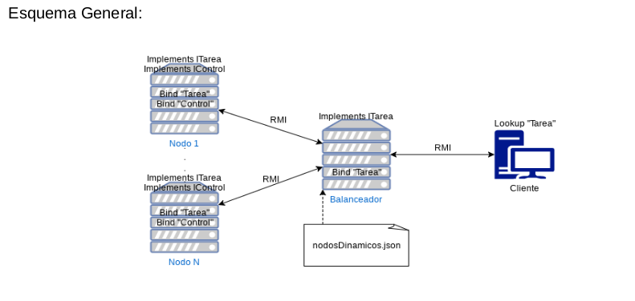
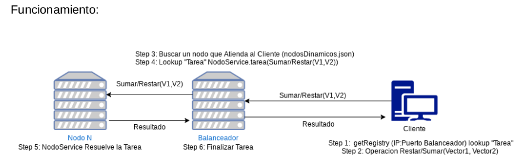

# Practica-SD

## Ejercicio 1
~~~
Red P2P de carga, búsqueda y descarga de archivos siguiendo las siguientes pautas:
Existen dos tipos de nodos, Maestros y Extremos. Los primeros, son servidores centralizados replicados
(al menos 2 nodos) que disponen del listado actualizado de los nodos extremos y se encargan de
gestionar la E/S de los peers. Los segundos cumplen dos funciones en el sistema: realizan consultas
(como clientes) y atienden solicitudes (como servidores).
Funcionamiento:
-- Cada extremo dispone de un parámetro definido en un archivo de inicialización con las direcciones IP de
los nodos Maestros. Al iniciarse se contacta con un maestro el cual funciona como punto de acceso al
sistema e informa cuáles son los archivos que dispone para compartir. Luego, está atento a trabajar en
dos modos (cliente y servidor)
-- Como cliente, deriva consultas al nodo maestro y una vez obtenida la respuesta, seleccionará el/los
recursos que desee descargar y se contactará con el par correspondiente para descargar el/los
archivo/s.
-- Como servidor, recibe la consulta, revisa si matchea la consulta con alguno de los recursos disponibles
y devuelve los resultados al nodo que solicitó resultados.
A partir de los conceptos vistos en la teoría, critique este modelo y presente mejoras en su propuesta.
~~~

~~~
Funcionamiento:
Todas las conexiones se realizan mediante Sockets.
Para Iniciar un Servidor Maestro, se debe ejecutar la Clase IniciarMaestro la cual esta ubicada
dentro del paquete “ejer1.maestro”. La clase IniciarMaestro leerá el archivo Json de
configuración “dataConexion.json” ubicado en el directorio raíz del proyecto el cual contiene las
direcciones Ip:Puerto disponibles para los Nodos Maestros, y creara un nuevo NodoMaestro al
cual envía las direcciones Ip:Puerto en forma de Lista. La clase NodoMaestro intentara
“levantar” un servidor socket en alguna de las direcciones que recibió. En este punto se cuenta
con un servidor Maestro y la red P2P ya puede funcionar, solo que no dispone de un servidor
Secundario. Para contar con un servidor Secundario se debe ejecutar la clase IniciarMaestro
nuevamente, y si se cuenta con otra dirección Ip:Puerto disponibles se levantara el
ServidorMaestro Secundario.
Replicación:
Los Nodos Maestros mantienen una lista con los Nodos Extremos y los recursos que Disponen,
al realizar una modificación (alta o baja de nodo Extremo) sobre esa lista se intenta enviar la
misma a otro de los maestros disponibles en la lista de Maestros (dataConexion.json) para que
registren los cambios.

~~~

  
~~~
Funcionamiento:  
Para Iniciar un Nodo Extremo se debe ejecutar la clase IniciarExtremo la cual se ubica dentro  
del paquete “ejer1.extremo” en el directorio raíz del proyecto.  
La clase IniciarExtremo creara un nuevo NodoExtremo al cual le pasa como parámetro una  
lista (dataConexion.json) que contiene las direcciones de los servidores Maestros.  
Al iniciar el NodoExtremo, intentara conectarse mediante Sockets a alguna de las direcciones  
de NodosMaestros disponibles en la lista. Si lo logra solicita al usuario que ingrese mediante  
teclado, la dirección de la carpeta local que contiene los archivos que se desean compartir  
(ej. /home/facundo/SDyPP/ ). Se leen los archivos disponibles en ese directorio y se envían  
mediante sockets al Servidor Maestro con el que se logro Conectar.  
Se inicia el ServerSide del NodoExtremo el cual se encuentra en espera de peticiones de  
Recursos de otros NodosExtremos. También se inicia un Thread que se encarga de realizar un  
“ping” al ServidorMaestro al cual se encuentra conectado el Extremo para detectar si en algún  
momento la conexión se pierde y si es así reintentar conectar con alguno de los otros Maestros  
disponibles en la Lista.  
~~~
    
 

 
  
~~~
Criticas al Modelo:  
La principal desventaja del modelo es la centralización, cada vez que se requiere de un recurso  
se debe consultar la lista del nodo Maestro. En un escenario con una cantidad reducida de  
Nodos Extremos no resulta un problema mayor, pero a medida que la red crece comienza a ser  
un problema grave ya que todos los Nodos Extremos realizarían consultas sobre el mismo  
Servidor, y este todo el tiempo estaría enviando al Servidor Secundario la replica.  
Mejoras al Modelo:  
Una mejora posible consiste en Descentralizar el modelo, pero no al extremo, ya que una red  
totalmente descentralizada también tendría problemas debido a que cada nodo debe conocer a  
todos los demás que están en la red, lo cual resulta poco escalable.  
La mejor opción seria Descentralizar la Lista de Los recursos, y contar con varios Nodos  
Maestros capaces de responder consultas, cada Nodo Extremo contaría con una lista de  
Maestros donde puede realizar consultas y si obtiene una respuesta negativa en uno puede  
intentar con otro.  
~~~

## Ejercicio 3  
  
~~~
Construya una red flexible y elástica de nodos (servicios) la cual se adapte (crece/decrece)  
dependiendo de la carga de trabajo de la misma. El esquema será el de un  
balanceador de carga y nodos detrás que atienden los pedidos. Para ello deberá  
implementar mínimamente:  
-Simulación de carga de nodos. Creación dinámica de conexiones de clientes y  
pedidos de atención al servicio publicado.  
-Protocolo de sensado para carga general del sistema. Elija un criterio para detectar esa carga y  
descríbalo. Ejemplo: cantidad de clientes en simultáneo que el servicio puede atender. Si se excede esa  
cantidad, el punto de entrada (balanceador de carga) crea dinámicamente un nuevo servicio.  
-Definición de umbrales de estado {sin carga, normal, alerta, crítico}  
-Creación, puesta en funcionamiento de los servicios nuevos, y remoción de ellos cuando no sean más  
necesarios. Para esto el balanceador puede contar con una lista de IPs donde los servicios están  
instalados y pueden correr. De forma tal que arrancando inicialmente con 2 servicios en 2 nodos distintos,  
el sistema escala dinámicamente en función de la carga del sistema, usando los nodos listados en ese  
archivo de configuración. Si fuera necesario, puede haber más de un servicio en un mismo nodo. El  
servicio debe ser multi thread.  
  
En la resolución de este ejercicio se utilizo RMI para la comunicación entre los distintos nodos.  
Para correr el ejercicio en primer lugar ejecutar la clase InitBalanceador del paquete “ejer3.run”,  
luego la clase SimulacionMultiplesClientes la cual genera múltiples clientes que solicitan tareas  
al azar de las definidas sobre el balanceador. Para el ejercicio se definieron tareas simples que  
consisten en sumar y restar vectores, estas operaciones se definen en la interface ITarea y son  
realizadas por los NodoService. Para observar fácilmente los resultados se coloco una demora  
en la resolución de las tareas.  
~~~
  
 

   
  
  

   
  
~~~
El cliente solicita al balanceador realizar una tarea, el balanceador debe asignarle a algún nodo  
de los disponibles la tarea, para ello revisa una lista que posee con los nodos y las tareas que  
esta realizando, cada nodo cuenta con estados definidos como constantes, para este ejercicio  
se definió:  
SIN_CARGA → 0 Tareas  
NORMAL → 3 Tareas  
ALERTA → 4 Tareas  
CRITICO → 5 Tareas  
Si el nodo se encuentra en estado “Sin Carga ” o “Normal” se le asigna la tarea directamente y  
se registra la misma en la lista.  
Si el Nodo se encuentra en “Alerta” si es posible se creara un nuevo nodo, para ello se lee el  
archivo nodosDinamicos.json que posee las direcciones disponibles para levantar los nuevos  
NodoService. Si se pudo crear un nuevo Nodo se asigna a este la tarea y se registra en la lista.  
Si no fue posible la creación del nuevo Nodo la tarea se asigna al nodo que se encontraba en  
“Alerta”.  
Si el nodo se encuentra en estado “Critico” no puede atender mas tareas, ante lo cual se  
intenta crear nuevos nodos, si no es posible se espera un determinado tiempo y para que algún  
nodo se libere y pueda atender nuevamente.  
Para la asignación de las tareas el Balanceador mantiene la lista ordenada y siempre asigna la  
tarea al nodo que menos tareas este resolviendo.  
Una vez asignada la tarea mediante RMI se solicita la resolución y se espera por una  
respuesta, la cual luego se envía al cliente por RMI.  
Siempre el Balanceador mantiene activos 2 Nodos, si se tiene una cantidad mayor de activos y  
alguno se encuentra en estado “Sin Carga” se da de baja, para ello utiliza la interface IControl.  
~~~
  
## Ejercicio 4  
  
~~~
El operador de Sobel es una máscara que, aplicada a una imagen, permite detectar  
(resaltar) bordes. Este operador es una operación matemática que, aplicada a cada  
píxel y teniendo en cuenta los píxeles que lo rodean, obtiene un nuevo valor (color)  
para ese píxel. Aplicando la operación a cada pixel, se obtiene una nueva imagen que  
resalta los bordes.  
a) Desarrollar un proceso centralizado que tome una imagen, aplique la máscara, y genere un nuevo  
archivo con el resultado.  
b) Desarrolle este proceso de manera distribuida donde se debe partir la imagen en n pedazos, y asignar la  
tarea de aplicar la máscara a N procesos distribuidos. Después deberá juntar los resultados. Se sugiere  
implementar los procesos distribuidos usando RMI. A partir de ambas implementaciones, comente los  
resultados de performance dependiendo de la cantidad de nodos y tamaño de imagen.  
c) Mejore la aplicación del punto anterior para que, en caso de que un proceso distribuido (al que se le  
asignó parte de la imagen a procesar) se caiga y no responda, el proceso principal detecte esta situación y  
pida este cálculo a otro proceso.  
Para correr el ejercicio centralizado se debe ejecutar el main que se encuentra en el paquete  
“ejer4.centralizado”, utiliza una imagen que por defecto se encuentran en el directorio  
“repositorioImagenes” .  
Para correr el ejercicio Distribuido para el cual se utilizo el sistema RabbitMQ ejecutar en primer  
lugar la clase Maestro del paquete “ejer4.distribuido” y luego la clase Cliente.  
Se implemento un sistema de colas:  
• queueTrabajos: En esta cola el Servidor maestro coloca todos los trozos de imágenes  
que previamente corto.  
• queueEnProceso: En esta cola los worker colocan los bytes de la imagen con la cual  
están trabajando.  
• queueTerminados: En esta cola los worker ingresan los trozos de imágenes ya  
procesadas con el filtro.  
Funcionamiento:  
1. El Maestro inicia, crea las colas, publica sus servicios RMI y queda a la espera.  
2. El cliente inicia, invoca la función que publico el Maestro.  
3. El Maestro toma el tiempo de inicio, purga las colas, troza las imágenes en una cantidad  
definida, publica todos los trozos en queueTrabajos e instancia una cantidad definida de  
Workers. Se quedará esperando que la cantidad de mensajes de la cola  
“queueTerminados” sea igual a la cantidad de trozos que el realizo.  
4. El worker una vez instanciado pregunta la cantidad de trabajos que hay (cantidad de  
mensajes de la cola “queueTrabajos”, luego pregunta la cantidad de mensajes de la cola  
“queueTerminados” (este será su punto de corte). Toma un mensaje de la cola de  
trabajos, compara si los bytes de ese mensaje son iguales a los bytes de cada mensaje  
de la cola “en proceso”, si no encuentra que haya uno igual, coloca esos bytes en la cola    
en proceso y empieza a realizar el aplique del filtro. Si encuentra que hay uno igual,  
toma otro mensaje de la cola “queueTrabajos”. Una vez que la cantidad de mensajes de  
terminados es igual a trabajos termina su ejecución.  
5. El Maestro trae todos los mensajes de queueTerminados y los ordena (gracias a un  
atributo de la clase Imagen que se utiliza para saber que nro. de trozo es). Une todos los  
trozos ordenadamente y devuelve al cliente la imagen con el filtro Sobel.  
~~~

   
