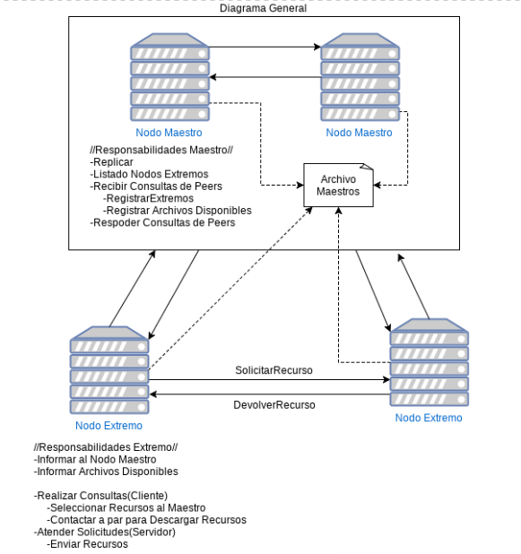
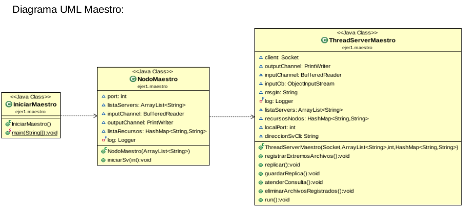
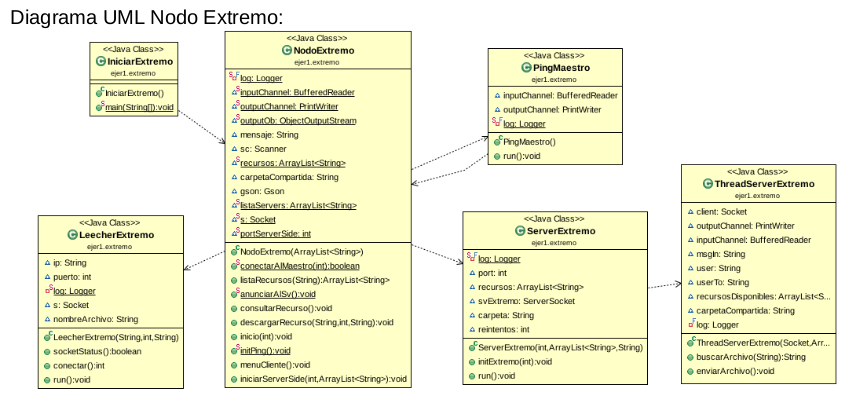
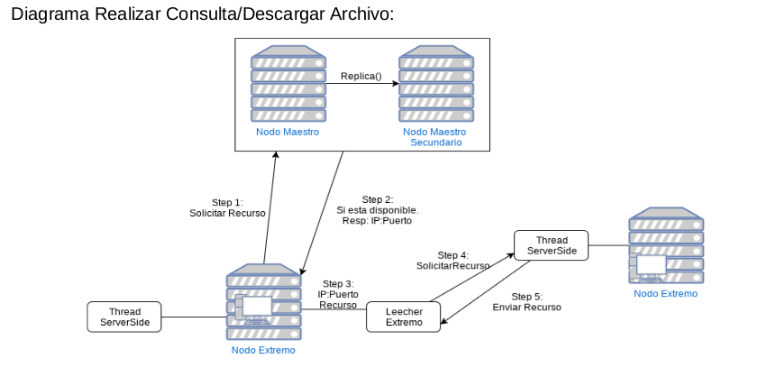

# Practica-SD

## Ejercicio 1
~~~
Red P2P de carga, búsqueda y descarga de archivos siguiendo las siguientes pautas:
Existen dos tipos de nodos, Maestros y Extremos. Los primeros, son servidores centralizados replicados
(al menos 2 nodos) que disponen del listado actualizado de los nodos extremos y se encargan de
gestionar la E/S de los peers. Los segundos cumplen dos funciones en el sistema: realizan consultas
(como clientes) y atienden solicitudes (como servidores).
Funcionamiento:
-- Cada extremo dispone de un parámetro definido en un archivo de inicialización con las direcciones IP de
los nodos Maestros. Al iniciarse se contacta con un maestro el cual funciona como punto de acceso al
sistema e informa cuáles son los archivos que dispone para compartir. Luego, está atento a trabajar en
dos modos (cliente y servidor)
-- Como cliente, deriva consultas al nodo maestro y una vez obtenida la respuesta, seleccionará el/los
recursos que desee descargar y se contactará con el par correspondiente para descargar el/los
archivo/s.
-- Como servidor, recibe la consulta, revisa si matchea la consulta con alguno de los recursos disponibles
y devuelve los resultados al nodo que solicitó resultados.
A partir de los conceptos vistos en la teoría, critique este modelo y presente mejoras en su propuesta.
~~~

~~~
Funcionamiento:
Todas las conexiones se realizan mediante Sockets.
Para Iniciar un Servidor Maestro, se debe ejecutar la Clase IniciarMaestro la cual esta ubicada
dentro del paquete “ejer1.maestro”. La clase IniciarMaestro leerá el archivo Json de
configuración “dataConexion.json” ubicado en el directorio raíz del proyecto el cual contiene las
direcciones Ip:Puerto disponibles para los Nodos Maestros, y creara un nuevo NodoMaestro al
cual envía las direcciones Ip:Puerto en forma de Lista. La clase NodoMaestro intentara
“levantar” un servidor socket en alguna de las direcciones que recibió. En este punto se cuenta
con un servidor Maestro y la red P2P ya puede funcionar, solo que no dispone de un servidor
Secundario. Para contar con un servidor Secundario se debe ejecutar la clase IniciarMaestro
nuevamente, y si se cuenta con otra dirección Ip:Puerto disponibles se levantara el
ServidorMaestro Secundario.
Replicación:
Los Nodos Maestros mantienen una lista con los Nodos Extremos y los recursos que Disponen,
al realizar una modificación (alta o baja de nodo Extremo) sobre esa lista se intenta enviar la
misma a otro de los maestros disponibles en la lista de Maestros (dataConexion.json) para que
registren los cambios.

~~~

  
~~~
Funcionamiento:  
Para Iniciar un Nodo Extremo se debe ejecutar la clase IniciarExtremo la cual se ubica dentro  
del paquete “ejer1.extremo” en el directorio raíz del proyecto.  
La clase IniciarExtremo creara un nuevo NodoExtremo al cual le pasa como parámetro una  
lista (dataConexion.json) que contiene las direcciones de los servidores Maestros.  
Al iniciar el NodoExtremo, intentara conectarse mediante Sockets a alguna de las direcciones  
de NodosMaestros disponibles en la lista. Si lo logra solicita al usuario que ingrese mediante  
teclado, la dirección de la carpeta local que contiene los archivos que se desean compartir  
(ej. /home/facundo/SDyPP/ ). Se leen los archivos disponibles en ese directorio y se envían  
mediante sockets al Servidor Maestro con el que se logro Conectar.  
Se inicia el ServerSide del NodoExtremo el cual se encuentra en espera de peticiones de  
Recursos de otros NodosExtremos. También se inicia un Thread que se encarga de realizar un  
“ping” al ServidorMaestro al cual se encuentra conectado el Extremo para detectar si en algún  
momento la conexión se pierde y si es así reintentar conectar con alguno de los otros Maestros  
disponibles en la Lista.  
~~~
    
 

 
  
~~~
Criticas al Modelo:  
La principal desventaja del modelo es la centralización, cada vez que se requiere de un recurso  
se debe consultar la lista del nodo Maestro. En un escenario con una cantidad reducida de  
Nodos Extremos no resulta un problema mayor, pero a medida que la red crece comienza a ser  
un problema grave ya que todos los Nodos Extremos realizarían consultas sobre el mismo  
Servidor, y este todo el tiempo estaría enviando al Servidor Secundario la replica.  
Mejoras al Modelo:  
Una mejora posible consiste en Descentralizar el modelo, pero no al extremo, ya que una red  
totalmente descentralizada también tendría problemas debido a que cada nodo debe conocer a  
todos los demás que están en la red, lo cual resulta poco escalable.  
La mejor opción seria Descentralizar la Lista de Los recursos, y contar con varios Nodos  
Maestros capaces de responder consultas, cada Nodo Extremo contaría con una lista de  
Maestros donde puede realizar consultas y si obtiene una respuesta negativa en uno puede  
intentar con otro.  
~~~
